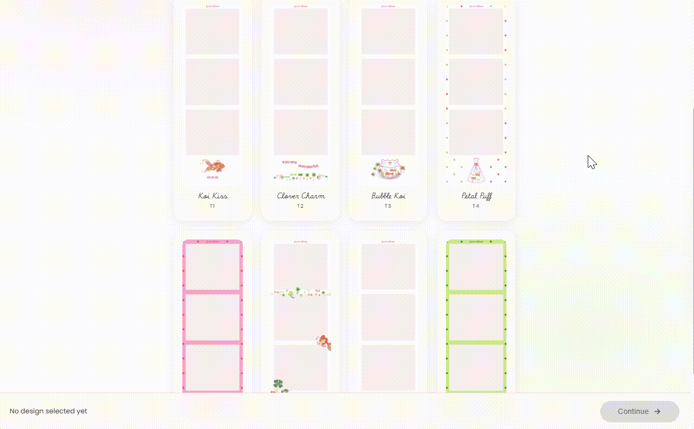

# Vendhee's Booth

A client-side photo booth web app for capturing or uploading photos, applying filters, and downloading customizable photo strips.

**Live Demo:** [vendhee-booth.netlify.app](https://vendhee-booth.netlify.app/)



## Overview

Vendhee's Booth is a fully client-side photo booth with no backend. Users go through 5 steps:

1. Select a design template (8 available)
2. Choose camera or upload mode
3. Capture 3 photos or upload them
4. Watch the print animation
5. Download the final photo strip

All data stays in the browser's localStorage.

## Tech Stack

- JavaScript (ES6+)
- HTML5 Canvas
- MediaDevices API (camera access)
- localStorage (data storage)
- CSS3 (styling)
- Google Fonts

## Project Structure

```
vendhee-booth/
├── index.html              # Template selection
├── mode.html               # Camera or upload choice
├── capture.html            # Photo capture page
├── print.html              # Print animation
├── final.html              # Download page
│
├── scripts/
│   ├── script.js           # Shared functions
│   ├── menu.js             # Template grid
│   ├── capture.js          # Camera & upload logic
│   ├── print.js            # Print animation
│   └── final.js            # Final page
│
├── styles/
│   ├── styles.css
│   ├── menu.css
│   ├── capture.css
│   └── print.css
│
└── assets/
    ├── logo.png
    ├── 1-8.png (templates)
    └── date variants
```

## Getting Started

### Local Development

```bash
# Clone the repo
git clone https://github.com/vendhee/vendhee-booth.git
cd vendhee-booth

# Start a local server
python -m http.server 8000

# Open in browser
# http://localhost:8000
```

### Deploy

**Netlify:**

```bash
netlify deploy --prod --dir=.
```

**Vercel:**

```bash
vercel --prod
```

**GitHub Pages:**
Push to repo and enable Pages in settings.

## How It Works

### User Flow

1. User picks a template design
2. User chooses camera or upload mode
3. User captures 3 photos (with filters/timer) or uploads them
4. Photos get composed onto the template
5. User downloads the final PNG

### Camera Mode Features

- Real-time video preview (mirrored)
- Countdown timer (3s, 5s, 10s)
- Flash effect on capture
- Filters: None, Sepia, B&W, Vintage
- Mobile optimized

### Upload Mode Features

- Drag and drop support
- Batch file upload
- Live preview
- Delete photos individually
- Auto compression on mobile

## Key Functions

All functions in `scripts/script.js`:

| Function                                               | Purpose                                            |
| ------------------------------------------------------ | -------------------------------------------------- |
| `loadImage(src)`                                       | Load image from data URL                           |
| `drawPhotoInSlot(ctx, img, slot)`                      | Place photo in strip slot                          |
| `drawDate(ctx, w, h, templateId)`                      | Add date to strip                                  |
| `getTemplatePng(templateId)`                           | Get template filename                              |
| `getDateString()`                                      | Format date as MM.DD.YY                            |
| `composeStripToCanvas(canvas, templateId, photosJson)` | Create final strip (used by print and final pages) |
| `applyPixelFilter(ctx, w, h, filter)`                  | Apply color filter                                 |
| `sleep(ms)`                                            | Delay execution                                    |

## Data Storage

State saved in localStorage:

```javascript
vendee_template; // Selected template (1-8)
vendee_mode; // "camera" or "upload"
vendee_photos; // Array of 3 photo data URLs
vendee_filter; // Active filter name
vendee_photo_filters; // Array of filters used per photo
```

## Browser Support

- Chrome 90+
- Firefox 88+
- Safari 14+
- Edge 90+
- Opera 76+

**Requirements:**

- MediaDevices API (for camera)
- Canvas 2D Context
- Promise / async-await
- CSS Grid & Flexbox

**Note:** HTTPS required for camera access (except localhost)

## Customization

### Add New Templates

1. Create 1875×5625px PNG with photo slots
2. Save as `assets/{id}.png`
3. Add to templates in `scripts/menu.js`:
   ```javascript
   { id: 9, name: "Template Name", tag: " T9" }
   ```
4. If custom date position needed, update `DATE_CONFIG` in `scripts/script.js`

### Add New Filters

Edit `applyPixelFilter()` in `scripts/script.js`:

```javascript
} else if (filter === "cool") {
  for (let i = 0; i < d.length; i += 4) {
    d[i] = Math.min(255, d[i] * 0.9)      // Less red
    d[i+2] = Math.min(255, d[i+2] * 1.2)  // More blue
  }
}
```

Add button in `capture.html`:

```html
<button class="btn-toggle filter-btn" onclick="setFilter('cool', this)">
  Cool
</button>
```

### Adjust Photo Compression

Edit in `scripts/capture.js`:

```javascript
const MAX_PHOTO_DIM_PHONE = 900; // Max size on phone
const PHONE_SAVE_QUALITY = 0.74; // Quality 0-1
const MAX_PHOTO_DIM_DESKTOP = 0; // 0 = no limit
const DESKTOP_SAVE_QUALITY = 0.92; // Quality 0-1
```

## Troubleshooting

### Camera Not Working

- Grant camera permission when prompted
- Check browser privacy settings
- Use HTTPS (localhost is exception)
- Try incognito mode
- Check device camera isn't in use

### Storage Full

- Use upload mode with compression
- Clear browser cache
- Check storage: ~300-400KB per session

### Print Animation Doesn't Play

- Check browser console for errors
- Verify fonts loaded
- Check network tab for failed assets
- Test in different browser

### Photo Quality Issues

- Ensure good lighting
- Use 3s timer to avoid blur
- Check if browser applies compression
- Verify device camera quality

### Upload Not Working

- Ensure files are image format
- Try different browser
- Check if files are too large
- Verify drag-and-drop works

## Development

```bash
# Make changes
vim scripts/script.js

# Test locally
python -m http.server 8000

# Commit
git add .
git commit -m "description of change"

# Deploy
git push origin main
netlify deploy --prod --dir=.
```

## Performance

- Page load: ~200ms
- Template load: ~100ms per image
- Photo composition: ~500ms for 3 photos
- Print animation: 2 seconds

Storage per session: 200-400KB in localStorage

## License

© 2025 Vendhee. All rights reserved.

**Support:** alvendherfrancisco01@gmail.com
